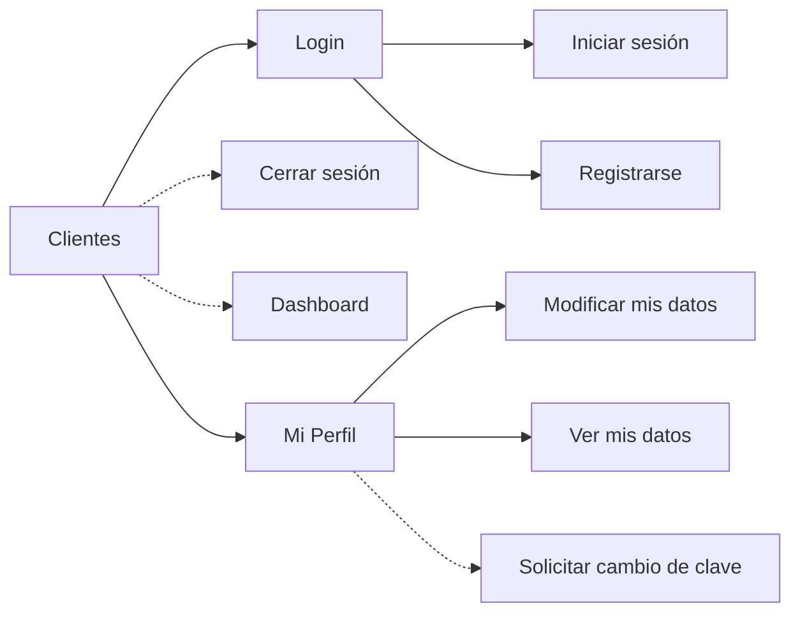

# Estructura de páginas de Clientes. 
Las flechas punteadas simbolizan funciones que **aún no están disponibles**.

```mermaid
graph LR;
    Clientes-->Login;
    Clientes-.->logout[Cerrar sesión];
    Login-->id1[Iniciar sesión];
    Login-->Registrarse;
    Clientes-.->Dashboard;
    Clientes-->me[Mi Perfil];
    me-->id3[Modificar mis datos];
    me-->id4[Ver mis datos];
    me-.->cambiarclave[Solicitar cambio de clave]

```
